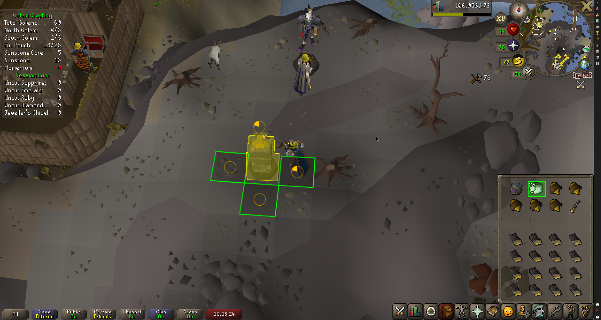
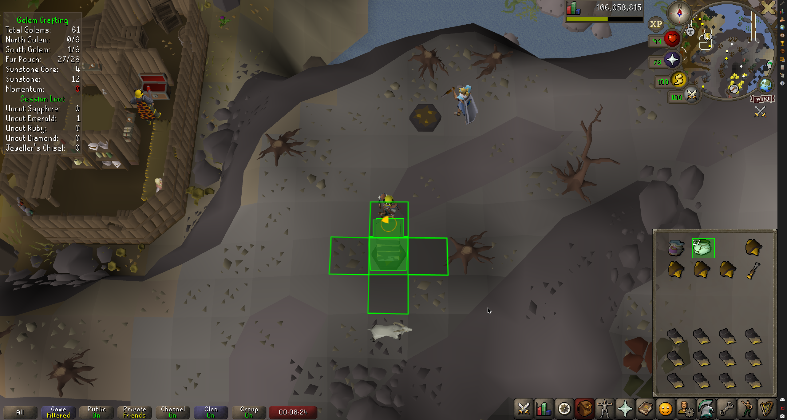
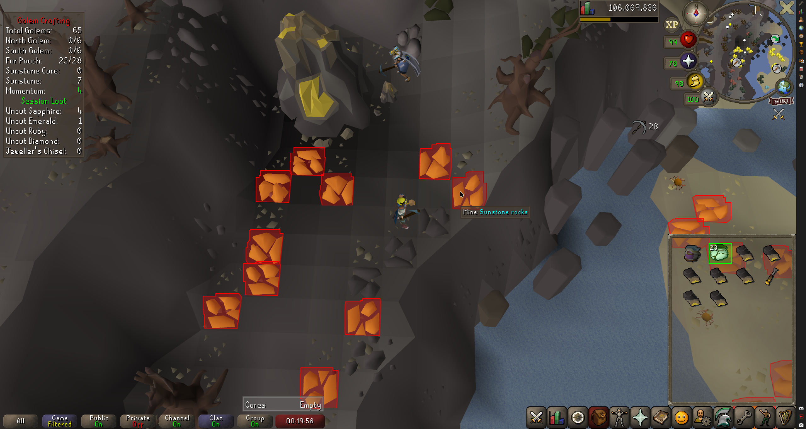

# Golem Crafting
A RuneLite plugin for the Sunstone Golem Crafting activity on the island of Wyrmscraig.

The primary feature is showing how far along the golem is, with many configuration options, as well as an info box showing:
* Total golems crafted and how far along the North and South golems are.
* How many furs are still in your fur pouch.
* How many Sunstone Cores and Sunstone you have in your inventory.
* How many ticks remain of your momentum while mining Sunstone rocks.
* How many uncut sapphires, emeralds, rubies, and diamonds you have recieved in the current session.
* How many Jeweller's Chisels you have recieved in the current session.

*After installing this plugin, be sure to right click your Fur Pouch and click "Check" so it knows how much fur is in the Fur Pouch.*

# Screenshots

Crafting the 2nd side of a golem, captured while the golem is flashing yellow to indicate you can save a tick by clicking again.

Configurable progress bars that can be shown on each side and the plinth, only on each side, only on the plinth (pictured above) or disabled.

Sunstone rocks highlighted in red after mining one, indicating you've got momentum

# Configuration Options
## Notifications
Configure notifications for the plugin.

## Infobox
Configure the main infobox.

### Show infobox
Show the main infobox with details on the state of golem crafting.

### Show total golems
Show the total number of golems crafted.

### Show state
Show how far along the north and south golems are.

### Show fur pouch
Show the amount of fur in your fur pouch.

### Show fur
Show the amount of fur in your inventory.

### Show sunstone
Show the amount of sunstone and sunstone cores in your inventory.

### Show sunstone momentum
Show the number of ticks remaining of your sunstone mining momentum.

### Show loot
Show the number of uncut gems and Jeweller's Chisels you have received in your current session.

### Fur Pouch Unknown Text Colour
The colour of the fur pouch text when the amount of fur in the pouch is unknown.

### Fur Pouch Low Text Colour
The colour of the fur pouch text when the amount of fur in the pouch is low.

### Fur Pouch Empty Text Colour
The colour of the fur pouch text when the pouch is empty.

## Resource Warning Infobox
Configure the resource warning infobox.

### Enabled
Enables a resource warning infobox.

### Flash on Empty
Flashes this infobox when something is missing.

### Warn on Chisel
Warns you when you are not holding a Chisel or Jeweller's Chisel.

### Warn on Hammer
Warns you when you are not holding a Hammer or Imcando Hammer.

### Warn on Fur
Warns you when you are low on fur.

### Fur Threshold
How much fur is considered low.

Set this to 0 to only warn when you're out of fur.

### Warn on Sunstone
Warns you when you are low on Sunstone.

### Sunstone Threshold
How much Sunstone is considered low.

Set this to 0 to only warn when you're out of Sunstone.

### Warn on Sunstone Core
Warns you when you are low on Sunstone cores.

### Core Threshold
How many Sunstone Cores are considered low.

Set this to 0 to only warn when you're out of Sunstone cores.

### Low Colour
The background colour of this infobox when something is low.

### Empty Colour 1
The background colour of this infobox when something is empty or missing.

### Empty Colour 2
The second background colour of this infobox when something is empty or missing and "Flash on Empty" is enabled.

## Plinth Overlays
Configure overlays for the plinths.

### Highlight Plinth
Highlight empty plinths or the active one when there is a work-in-progress golem on one.

Also shows a progress bar on plinths that aren't ready to use again yet.

### Render style
How to render the highlight.

* **Clickbox**: Render the plinth's clickbox.
* **Hull**: Render the plinth's hull.

### Highlight Efficiency
Highlight the active plinth in a different colour when you can click to save a tick.

### Show Sunlight Core
Show an icon on top of the active plinth when it is time to put in a Sunstone Core.

### Progress/Core Z Offset
How high above the plinth to render progress bars or icons.

### Valid Colour
The colour of the plinth when you're on a side you've not shaped yet.

### Efficiency Colour
The colour of the plinth when you can click to save a tick.

### Invalid Colour
The colour of the plinth when you're on a side you've already shaped.

### Valid Core Colour
The colour of the plinth when you're on the right side to insert the core.

### Invalid Core Colour
The colour of the plinth when you're on the wrong side to insert the core.

## Plinth Menu Options
Configure menus on the plinths.

### Remove Options
Remove options when they're not relevant or usable.

### Remove Start Golem
Removes the Start-golem option when you're lacking materials.

### Remove Shape Golem
Removes the Shape-golem option when you're standing on a side you've already shaped.

### Remove Insert Core
Removes the Insert-core option when you're on the wrong side.

## Tiles
Configure tile markers.

### Highlight Incomplete
Highlight tiles on sides of the golem you've not shaped yet.

### Incomplete Colour
The colour to highlight tiles on sides of the golem you've not shaped yet in.

### Highlight Complete
Highlight tiles on sides of the golem you've already shaped.

### Incomplete Colour
The colour to highlight tiles on sides you've already shaped in.

## Progress
Configure progress bars.

### Show Progress
How to show your current progress.

* **None**: Do not show progress.
* **Tiles**: Show progress for each side on its respective tile.
* **Plinth**: Show progress for the current side on the plinth.
* **Both**: Show progress for each side on its respective tile and progress for the current side on the plinth.

### Colour
The colour of the progress bars.

## Sunstone
Highlight sunstones and show momentum.

Only shown when you do not have materials to make a golem.

### Highlight Sunstones
Which sunstones to highlight.

* **None**: Do not highlight sunstone.
* **Monolith**: Highlight the sunstone monolith.
* **Rocks**: Highlight the individual sunstone rocks.

### Render style
How to render the highlight.

* **Clickbox**: Render the monolith/rock's clickbox.
* **Hull**: Render the monolith/rock's hull.

### Show Momentum
Colour sunstone rocks a different colour when momentum is active.

### Sunstone Colour
The colour to highlight the sunstone monolith/rocks in.

### Momentum Colour
The colour to highlight sunstone rocks in when momentum is active.

## Fur Pouch
Configure overlays on the Fur Pouch in your inventory.

### Low Threshold
How many fur remaining is considered low.

### Always show
Always show the fur pouch overlays, even when outside the golem crafting area.

### Highlight Inventory
Show a box around the Fur Pouch in your inventory.

### Default Colour
The colour of the box when the Fur Pouch is above the Low Threshold.

### Low Colour
The colour of the box when the Fur Pouch is at or below the Low Threshold.

### Empty Colour
The colour of the box when the Fur Pouch is empty.

### Unknown Colour
The colour of the box when the amount of fur in the Fur Pouch is unknown.

You can right click and choose "Check" on the Fur Pouch to make the plugin aware of how much fur is in it.

### Show Count
Show the amount of fur left inside on the Fur Pouch on the top left of its inventory icon.

### Default Text Colour
The colour of the count text when the Fur Pouch is above the Low Threshold.

### Low Text Colour
The colour of the count text when the Fur Pouch is at or below the Low Threshold.

### Empty Text Colour
The colour of the count text when the Fur Pouch is empty.

### Unknown Text Colour
The colour of the count text when the amount of fur in the Fur Pouch is unknown.

## Game Chat
Configure related game chat messages.

### Hide finished angle
Hide the message shown when finishing one side of the golem.

### Hide repeated angle
Hide the message shown when clicking from a side of the golem you've already shaped.

### Hide total
Hide the message showing how many golems you've crafted.

### Hide loot
Hide loot messages when completing golems.

### Exclude Jeweller's Chisel
Always show the message when getting a Jeweller's Chisel even if "Hide loot" is enabled.

## Debug
### Debug
Enables debugging options.

Currently, none exist so this does nothing.